# LLM via WhatsApp - Codebase Explanation

> A real-time AI WhatsApp assistant that bridges Twilio Messaging with OpenAI's Chat Completion API, enabling users to have text conversations with an AI chatbot via WhatsApp.

---

## Table of Contents

1. [Overview](#overview)
2. [Architecture Diagram](#architecture-diagram)
3. [Technology Stack](#technology-stack)
4. [Project Structure](#project-structure)
5. [Component Breakdown](#component-breakdown)
6. [Data Flow](#data-flow)
7. [Configuration & Environment](#configuration--environment)
8. [Running the Application](#running-the-application)

---

## Overview

This application creates a **WhatsApp AI assistant** that:

1. Receives incoming WhatsApp messages via **Twilio Webhooks**
2. Processes text using **OpenAI's GPT-4o** model
3. Maintains **context/chat history** for each user (in-memory)
4. Responds back to the user via **Twilio Messaging Response**

The core change from the previous version is the switch from **Voice/WebSockets** to **Text/HTTP Webhooks**.

---

## Architecture Diagram

```mermaid
flowchart TB
    subgraph User
        Phone["📱 WhatsApp App"]
    end
    
    subgraph Twilio["Twilio Cloud"]
        TwilioSender["Twilio Sender"]
        Webhook["Webhook Trigger"]
    end
    
    subgraph Server["FastAPI Server"]
        Main["main.py<br/>Entry Point"]
        API["api.py<br/>Routes"]
        Service["chat_service.py<br/>Logic & Memory"]
        Config["config.py<br/>Settings"]
    end
    
    subgraph OpenAI["OpenAI Cloud"]
        ChatAPI["Chat Completions API<br/>(GPT-4o)"]
    end
    
    subgraph Scripts
        SendScript["send_message.py<br/>Outbound Messages"]
    end
    
    Phone -->|"Message"| TwilioSender
    TwilioSender -->|"POST /whatsapp"| API
    API -->|"Body, From"| Service
    Service <-->|"History + New Msg"| ChatAPI
    Service -->|"AI Response"| API
    API -->|"TwiML Response"| TwilioSender
    TwilioSender -->|"Reply"| Phone
    
    SendScript -->|"REST API"| TwilioSender
    Main --> API
    Config --> Service
    Config --> Main
```



---

## Technology Stack

| Technology | Purpose |
|------------|---------|
| **FastAPI** | Python web framework for handling the webhook |
| **Uvicorn** | ASGI server to run the FastAPI application |
| **Twilio** | WhatsApp messaging interface |
| **OpenAI API** | GPT-4o model for generating intelligence |
| **python-dotenv** | Environment variable management |
| **Ngrok** | Exposing the local server to the public internet |

### Dependencies (`requirements.txt`)

```text
fastapi      # Web framework
uvicorn      # ASGI server
twilio       # Twilio SDK for TwiML and Client
python-dotenv # Environment variable loading
openai       # OpenAI Python SDK
```

---

## Project Structure

```
LLM via WhatsApp/
├── .env.local                 # Environment variables (secrets)
├── ngrok-whatsapp.yml         # Ngrok configuration for specific tunnel
├── main.py                    # Application entry point
├── send_message.py            # Script to send outbound WhatsApp messages
├── requirements.txt           # Python dependencies
└── app/
    ├── __init__.py           # Package marker
    ├── config.py             # Configuration and settings
    ├── api.py                # FastAPI endpoints (Webhook)
    └── chat_service.py       # AI Logic and Conversation History
```

---

## Component Breakdown

### 1. `main.py` - Application Entry Point

**Purpose:** Initializes and runs the FastAPI application.

```python
from fastapi import FastAPI
from app.config import PORT
from app.api import router

app = FastAPI()
app.include_router(router)

if __name__ == "__main__":
    import uvicorn
    uvicorn.run(app, host="0.0.0.0", port=PORT)
```

### 2. `app/api.py` - Webhook Endpoint

**Purpose:** Receives the HTTP POST request from Twilio when a user sends a message.

- **Route:** `POST /whatsapp`
- **Input:** Form data (`Body`, `From`) sent by Twilio.
- **Action:** Calls `chat_service.get_chat_response`.
- **Output:** Returns **TwiML** (Twilio Markup Language) instructing Twilio to reply with the AI's text.

```python
@router.post("/whatsapp")
async def whatsapp_reply(Body: str = Form(...), From: str = Form(...)):
    # Get response from the Chat Service
    reply_text = await get_chat_response(Body, From)
    
    # Create TwiML Response
    response = MessagingResponse()
    response.message(reply_text)
    
    return Response(content=str(response), media_type="application/xml")
```

### 3. `app/chat_service.py` - Core Logic & Memory

**Purpose:** Manages the interaction with OpenAI and stores conversation history.

- **History:** Uses a global dictionary `conversation_history` to store messages per user number.
- **Logic:**
    1. Retrieval: Gets history for `sender_number`.
    2. Update: Appends the new user message.
    3. Generation: Sends full history to `openai.chat.completions.create`.
    4. Storage: Appends AI response to history.
    5. Return: Returns just the text for the reply.

**Note:** History is *in-memory* and will be lost if the server restarts.

### 4. `send_message.py` - Outbound Messaging

**Purpose:** A standalone script to initiate a conversation (send a message *to* a user).

- Uses `twilio.rest.Client`.
- Sends a template or freeform message to a destination number.
- Useful for notifications or starting a chat.

---

## Data Flow

### Incoming Message Flow (User -> Bot)

1. **User** sends "Hello" on WhatsApp.
2. **Twilio** receives the message and looks up your Webhook URL.
3. **Twilio** sends a `POST` request to your `ngrok` URL -> `localhost:5050/whatsapp`.
4. **FastAPI (`api.py`)** extracts the text "Hello" and sender ID.
5. **ChatService** adds "Hello" to history and calls OpenAI.
6. **OpenAI** returns "Hi there! How can I help?".
7. **FastAPI** wraps this in TwiML: `<Response><Message>Hi there!...</Message></Response>`.
8. **Twilio** reads the TwiML and sends that text back to the User.

---

## Configuration & Environment

### Required Environment Variables (`.env.local`)

| Variable | Description |
|----------|-------------|
| `OPENAI_API_KEY` | OpenAI API Key (`sk-proj-...`) |
| `TWILIO_ACCOUNT_SID`| Twilio Account SID |
| `TWILIO_AUTH_TOKEN` | Twilio Auth Token |
| `PORT` | Local server port (default: 5050) |

### Ngrok Configuration (`ngrok-whatsapp.yml`)

Used to create a dedicated tunnel configuration, preventing conflicts with other running projects.

```yaml
authtoken: <your-token>
version: 2
```

---

## Running the Application

### 1. Start the Server
```powershell
uvicorn main:app --reload --port 5050
```

### 2. Start the Tunnel
```powershell
ngrok http 5050 --config=ngrok-whatsapp.yml
```

### 3. Verification
- Send a message to your **Twilio Sandbox Number**.
- The bot should reply instantly.
